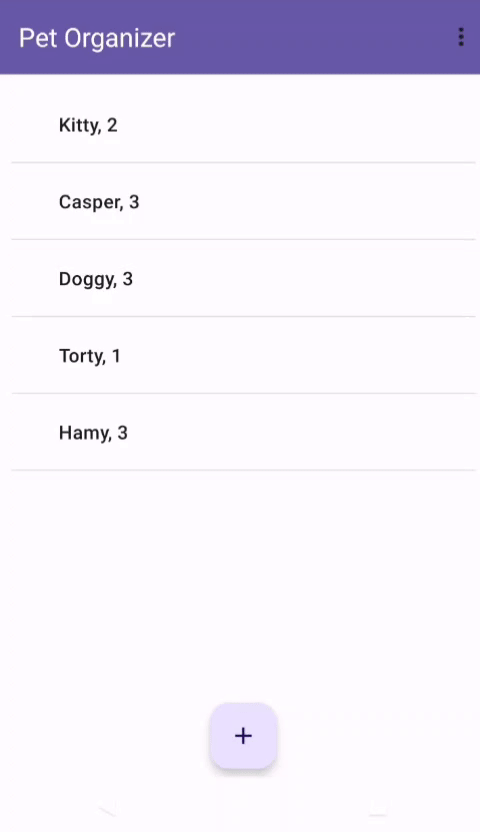
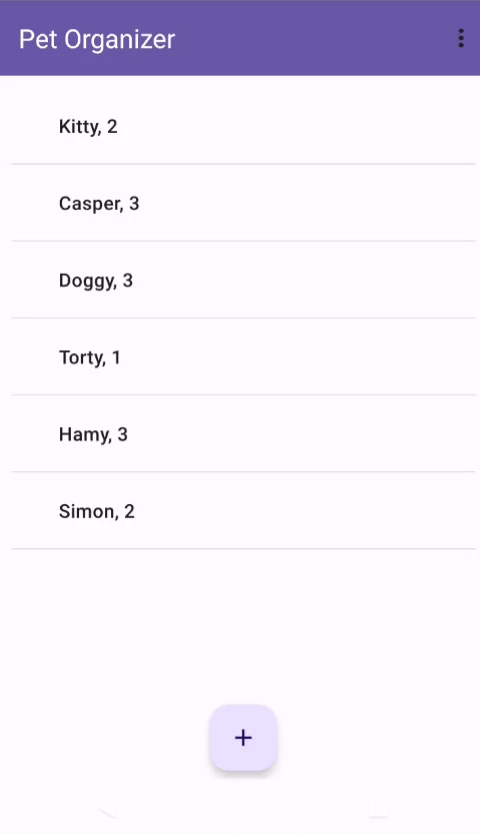
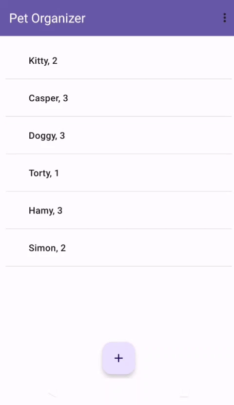

# Pet Organizer

 

The Pet Organizer App can be used to store and manage information about pets. Users are able to add, remove, and update pet information for any pets.
See below for functionality

  

#### Table of Contents
[Creating New Pet](#creating-new-pet) 
[Editing Existing Pet](#editing-existing-pet) 
[Deleting Existing Pet](#deleting-existing-pet) 

 

<a name="creating-new-pet"/>

## Creating New Pet

 
Users may enter details for the pet into the respective fields and add the pet to the list. 
Species, name, age, personality, and allergies may be selected or specified
 

<a name="editing-existing-pet"/>

## Editing Existing Pet

 
Users may change details for the respective fields of the pet they select and edit the pet to persist changes. 
Species is permanent and may not be edited
 

<a name="deleting-existing-pet"/>

## Deleting Existing Pet

 
Users may select a pet to delete from list of pets. Once deleted, the information of the pet is permanently erased
 

